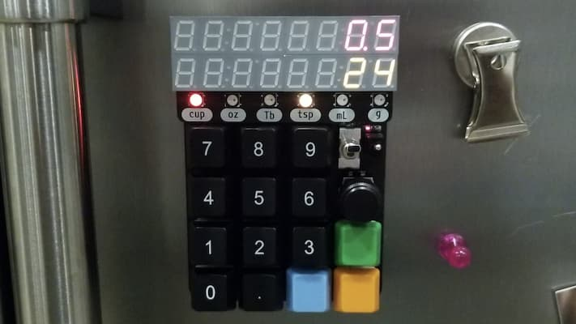

# Unitron

Unitron is a kitchen tool for working with important cooking units -- time, space, and mass -- using tactually-pleasing switches, knobs, and buttons, non-intrusive beeps, and exciting lights.

Unitron allows you to convert between common volume units (cups, ounces, tablespoons, teaspoons and milliliters). It can also convert from volume to mass (and vice-versa), taking into account the density of common cooking ingredients. This makes measuring ingredients for volume-based recipes with a kitchen scale a breeze. It also functions as a handy countdown timer!

Watch the demo video [here](https://vimeo.com/719658219).

Unitron was developed by Andy Lustig.

## Build Guide

### BOM

| Qty | Reference     | Description              | Value/MPN                                                                                                                                            |
| --- | ------------- | ------------------------ | ---------------------------------------------------------------------------------------------------------------------------------------------------- |
| 1   | BT2           | Battery Connector        | [2468](https://www.digikey.com/product-detail/en/keystone-electronics/2466/36-2466-ND/303815)                                                        |
| 1   | C1            | 0805 Capacitor           | 1µF                                                                                                                                                  |
| 1   | C2            | 0805 Capacitor           | 100nF                                                                                                                                                |
| 1   | C3            | 0805 Capacitor           | 10µF                                                                                                                                                 |
| 6   | D1-6          | Addressable RGB LED      | [WS2812B](https://cdn-shop.adafruit.com/datasheets/WS2812B.pdf)                                                                                      |
| 1   | D7            | Diode                    | [SM5817PL-TP](https://www.digikey.com/en/products/detail/micro-commercial-co/SM5817PL-TP/1793251)                                                    |
| 2   | D8, D9        | 0805 Indicator LED       | Red and Yellow                                                                                                                                       |
| 4   | H1-4          | Threaded Standoff        | [4207](https://www.adafruit.com/product/4207)                                                                                                        |
| 2   | J1, J3        | 1x8 male header          | [TSM-108-01-T-SV](https://www.digikey.com/en/products/detail/samtec-inc/TSM-108-01-T-SV/6679033)                                                     |
| 2   | J2, J4        | 1x8 female header        | [SSW-108-01-T-S](https://www.digikey.com/en/products/detail/samtec-inc/SSW-108-01-T-S/1112297)                                                       |
| 1   | LS1           | Buzzer                   | [PK-11N40PQ](https://www.digikey.com/en/products/detail/mallory-sonalert-products-inc/PK-11N40PQ/4996072?s=N4IgTCBcDaICwFYAcBaAjAZjmFA7AJiALoC%2BQA) |
| 21  | R1-18, R22-24 | 0805 Resistor            | 10KΩ                                                                                                                                                 |
| 3   | R19, R20, R21 | 0805 Resistor            | 2KΩ                                                                                                                                                  |
| 14  | S1-14         | Mechanical Key Switch    | [Gateron green](https://www.amazon.com/Gateron-KS-9-Mechanical-Type-Switch/dp/B07X3TH4DS?th=1)                                                       |
| 1   | SW1           | Small Toggle             | [B12AP](https://www.digikey.com/en/products/detail/nkk-switches/B12AP/379099)                                                                        |
| 1   | SW2           | Big Toggle               | [M2012EA2W13](https://www.digikey.com/en/products/detail/nkk-switches/M2012EA2W13/4509655)                                                           |
| 1   | SW3           | Rotary Encoder           | [PEC11R-4215F-S0024](https://www.digikey.com/en/products/detail/bourns-inc/PEC11R-4215F-S0024/4499665)                                               |
| 2   | U1, U2        | Yellow 4-Digit Display   | [LTC-4727JS](https://www.digikey.com/products/en?keywords=LTC-4727JS)                                                                                |
| 2   | U3, U8        | 7-Segment Display Driver | [AS1115-BSST](https://www.digikey.com/products/en?keywords=AS1115-BSSTCT-ND)                                                                         |
| 1   | U4            | QT Py RP2040             | [4900](https://www.adafruit.com/product/4900)                                                                                                        |
| 1   | U5            | Battery Charging IC      | [MCP73831](https://www.digikey.com/en/products/detail/microchip-technology/MCP73831T-2ATI-OT/964303)                                                 |
| 2   | U6, U7        | Red 4-Digit Display      | [LTC-4727JR](https://www.digikey.com/products/en?keywords=160-1551-5-nd)                                                                             |

  

### Additional Components
- A rechargeable 3.7V lithium polymer (LiPo) [battery](https://www.adafruit.com/product/1578)
- Threaded mounting [magnets](https://www.kjmagnetics.com/proddetail.asp?prod=MM-C-10)
- A satisfyingly knurled [metal knob](https://www.digikey.com/en/products/detail/kilo-international/OEDNI-63-4-7/5970335).
- Keycaps from WASD keycaps:
  - [number pad keycap set](https://www.wasdkeyboards.com/17-key-cherry-mx-number-pad-keycap-set.html) for the numbers (black, large font)
  - The number pad set comes with a 1x2 "0" keycap, but we want a [custom 1x1 "0" keycap](https://www.wasdkeyboards.com/custom-text-cherry-mx-keycaps.html) (R1 1x1, 26 font, center-center alignment)
  - [R1 1x1 keycaps](https://www.wasdkeyboards.com/row-1-size-1x1-cherry-mx-keycap.html) (sky blue, green, and orange)
- [Relegendable keycaps](https://www.adafruit.com/product/5039) are a good less expensive alternative.

## User Guide

### Component Diagram

### Turning it on!

The first step to using your Unitron is to turn it on with the smaller, right-most [On/Off switch](#diagram). When Unitron is on, the [LED panel](#diagram) and the red [Power indicator light](#diagram) will be lit up. Turn it off to save power.

### Switching Modes

Unitron has a [countdown timer mode](#timer) and [converter mode](#convert).
To **switch to modes**, click the [blue Mode button](#diagram).
Unitron will startup in the `start_mode` specified in your `settings.py` file (see [Modifying Unitron functionality](#modify)).
If the [blue Mode button](#diagram) is pressed down when turning on Unitron, it will startup in the opposite mode. 

### Countdown timer mode
To **set the timer**, use the number keys. To specify minutes and seconds, you can use the decimal key, e.g. 20.30 corresponds to 20 minutes and 30 seconds, while 20 corresponds to 20 seconds.

To **start** the timer, flip the [Toggle switch](#diagram). To **pause** the timer, flip the [Toggle switch](#diagram) again. The top, red row of the LED panel shows the time remaining, and the bottom orange row shows the original time requested.

To **clear** the timer, pause the timer (if necessary), then push the green [Clear button](#diagram).

As the timer counts down to 0, a bar of [Timer lights](#diagram) will progressively light up. When the timer reaches 0, it will beep three times.

### Converter mode
Unitron converts **from blinking to solid units** in the [Unit light](#diagram) row.

You can **enter the amount** of the **blinking "from"** units with the number keys. This will be shown in the [LED panel](#diagram). The corresponding amount in the **solid "to"** units will be shown in the other row of the [LED panel](#diagram).

You can **change units** using the [Knob](#diagram). Turning the knob changes the **blinking "from" units**. Turning the knob while holding it down changes the **solid "to" units**.

You can **swap** the "from" and "to" units with the [Toggle switch](#diagram).  If you find it difficult to hold down the Knob while turning it, you can use the Toggle switch to swap, turn the knob, then flip the Toggle switch back.

Conversions between volume and mass require knowing the density of the ingredient. You can **specify cooking ingredients** by holding down the orange [Ingredient button](#diagram) while turning the [Knob](#diagram). Note that the ingredient button only functions when the two units selected are mass and volume -- ingredient type does not matter when converting from mass to mass or volume to volume.

### Charging

Unitron is rechargeable. To charge it, plug a USB C cable into the [USB port](#diagram) at the top. The yellow charging indicator will be on while charging and will turn off when the battery is full.

### Placement

The back of Unitron has four strong magnets. It is meant to be placed on a metallic refrigerator.

###  Modifying Unitron functionality

Unitron uses [CircuitPython](https://learn.adafruit.com/welcome-to-circuitpython). 
You can modify the code it is running by connecting it to your computer via the [USB C port](#diagram) and mounting it as a disk drive.
Basic settings can be adjusted by editing the `settings.py` file.

**Change the mode that Unitron starts up in when turned on** by editing `start_mode`.

**Adjust the number of beeps** for when the timer expires by editing `beep_num`.

To **add new ingredients** to Unitron, modify `ingredients`. Specify the density in grams per teaspoon. You can try to measure these densities yourself, or you can trust the internet. Here's one [site](https://www.howmany.wiki/vw/) with information.

Make sure to **eject** Unitron before disconnecting.

### Updating Software

Connect to Unitron a computer via the [USB C port](#diagram) and mount it as a disk drive.
It should appear as "CIRCUITPY".
Download the latest software [release](https://github.com/alustig3/unitron/releases).
Unzip the download and copy the files onto the "CIRCUITPY" drive.

## Licenses
<!--?xml version="1.0" encoding="UTF-8" standalone="no"?-->
<svg xmlns:dc="http://purl.org/dc/elements/1.1/" xmlns:cc="http://creativecommons.org/ns#" xmlns:rdf="http://www.w3.org/1999/02/22-rdf-syntax-ns#" xmlns:svg="http://www.w3.org/2000/svg" xmlns="http://www.w3.org/2000/svg" viewBox="0 0 210.51138 109.06277" height="109.06277" width="210.51138" xml:space="preserve" id="svg1011" version="1.1"><metadata id="metadata1017"><rdf:rdf><cc:work rdf:about=""><dc:format>image/svg+xml</dc:format><dc:type rdf:resource="http://purl.org/dc/dcmitype/StillImage"></dc:type><dc:title></dc:title></cc:work></rdf:rdf></metadata><defs id="defs1015"><clipPath id="clipPath1029" clipPathUnits="userSpaceOnUse"><path id="path1027" d="M 0,0 H 365760 V 205740 H 0 Z"></path></clipPath></defs><g transform="matrix(1.3333333,0,0,-1.3333333,-3.4343762,536.56561)" id="g1019"><g transform="matrix(1,0,0,-1,0,405)" id="g1021"><g transform="scale(0.0019685)" id="g1023"><g clip-path="url(#clipPath1029)" id="g1025"><g id="g1037"><g id="g1039"><path id="path1041" style="fill:#ffffff;fill-opacity:1;fill-rule:evenodd;stroke:none" d="M 1499,1499 H 81323 V 42671 H 1499 Z"></path></g><path id="path1043" style="fill:none;stroke:#595959;stroke-width:381;stroke-linecap:butt;stroke-linejoin:round;stroke-miterlimit:8;stroke-dasharray:none;stroke-opacity:1" d="M 1499,1499 H 81323 V 42671 H 1499 Z"></path></g><g id="g1045"><g id="g1047"><g id="g1049"><path id="path1051" style="fill:#000000;fill-opacity:0;fill-rule:evenodd;stroke:none" d="M 3882.196,12543.278 H 78942.195"></path></g></g><path id="path1053" style="fill:none;stroke:#595959;stroke-width:1524;stroke-linecap:butt;stroke-linejoin:round;stroke-miterlimit:8;stroke-dasharray:none;stroke-opacity:1" d="M 3882.196,12543.278 H 78942.195"></path></g><g id="g1055"><g id="g1057"><g id="g1059"><path id="path1061" style="fill:#000000;fill-opacity:0;fill-rule:evenodd;stroke:none" d="M 4509.141,3507.0806 H 78309.14 V 11043.08 H 4509.141 Z"></path></g></g></g><g transform="scale(381)" id="g1063"><g transform="translate(11.835016,9.204936)" id="g1065"><g id="g1067"><text id="text1071" style="font-variant:normal;font-weight:bold;font-size:16px;font-family:'Helvetica Neue','Helvetica',Arial,sans-serif;-inkscape-font-specification:HelveticaNeue-Bold;writing-mode:lr-tb;fill:#000000;fill-opacity:1;fill-rule:nonzero;stroke:none" transform="translate(0,15.749763)"><tspan id="tspan1069" y="0" x="0 12.432 22.191999 31.375999 40.848 45.279999 55.647999 65.407997 74.879997 80.991997 90.176003 99.360001 103.792 113.264 117.376 126.56 135.744 145.216 153.808 162.992 171.584">Open Source Licenses </tspan></text></g></g></g><g transform="scale(381)" id="g1073"></g><g id="g1075"><g id="g1077"><g id="g1079"><path id="path1081" style="fill:#000000;fill-opacity:0;fill-rule:evenodd;stroke:none" d="M 4811.468,13579.788 H 40151.47 v 7535.999 H 4811.468 Z"></path></g></g></g><g transform="scale(381)" id="g1083"><g transform="translate(12.628525,35.642487)" id="g1085"><g id="g1087"><text id="text1091" style="font-variant:normal;font-weight:normal;font-size:10.6667px;font-family:'Helvetica Neue','Helvetica',Arial,sans-;-inkscape-font-specification:HelveticaNeue;writing-mode:lr-tb;fill:#000000;fill-opacity:1;fill-rule:nonzero;stroke:none" transform="translate(0,13.629764)"><tspan id="tspan1089" y="0" x="0 7.7013335 13.429334 16.789333 23.104 31.178667 36.90667 40.266666">Hardware</tspan></text></g></g></g><g transform="scale(381)" id="g1093"></g><g id="g1095"><g id="g1097"><g id="g1099"><path id="path1101" style="fill:#000000;fill-opacity:0;fill-rule:evenodd;stroke:none" d="M 4811.468,22147.285 H 40151.47 v 7536 H 4811.468 Z"></path></g></g></g><g transform="scale(381)" id="g1103"><g transform="translate(12.628525,58.129356)" id="g1105"><g id="g1107"><text id="text1111" style="font-variant:normal;font-weight:normal;font-size:10.6667px;font-family:'Helvetica Neue','Helvetica',Arial,sans-;-inkscape-font-specification:HelveticaNeue;writing-mode:lr-tb;fill:#000000;fill-opacity:1;fill-rule:nonzero;stroke:none" transform="translate(0,13.629764)"><tspan id="tspan1109" y="0" x="0 6.9013333 13.024 16.170668 19.52 27.594667 33.322666 36.682667">Software</tspan></text></g></g></g><g transform="scale(381)" id="g1113"></g><g id="g1115"><g id="g1117"><g id="g1119"><path id="path1121" style="fill:#000000;fill-opacity:0;fill-rule:evenodd;stroke:none" d="m 4811.227,30714.783 h 35340 v 7535.997 h -35340 z"></path></g></g></g><g transform="scale(381)" id="g1123"><g transform="translate(12.627893,80.61623)" id="g1125"><g id="g1127"><text id="text1131" style="font-variant:normal;font-weight:normal;font-size:10.6667px;font-family:'Helvetica Neue','Helvetica',Arial,sans-;-inkscape-font-specification:HelveticaNeue;writing-mode:lr-tb;fill:#000000;fill-opacity:1;fill-rule:nonzero;stroke:none" transform="translate(0,13.629764)"><tspan id="tspan1129" y="0" x="0 7.5093336 13.632 19.360001 25.290667 34.389336 40.117336 46.048 49.397335 55.125336 58.474667 60.84267 66.965332">Documentation</tspan></text></g></g></g><g transform="scale(381)" id="g1133"></g><g id="g1135"><g id="g1137"><g id="g1139"><path id="path1141" style="fill:#000000;fill-opacity:0;fill-rule:evenodd;stroke:none" d="M 3882.196,39149.8 H 78942.195"></path></g></g><path id="path1143" style="fill:none;stroke:#595959;stroke-width:1524;stroke-linecap:butt;stroke-linejoin:round;stroke-miterlimit:8;stroke-dasharray:none;stroke-opacity:1" d="M 3882.196,39149.8 H 78942.195"></path></g><g id="g1145"><g id="g1147"><g id="g1149"><path id="path1151" style="fill:#000000;fill-opacity:0;fill-rule:evenodd;stroke:none" d="M 3255.2507,30714.947 H 78315.25"></path></g></g><path id="path1153" style="fill:none;stroke:#595959;stroke-width:381;stroke-linecap:butt;stroke-linejoin:round;stroke-miterlimit:8;stroke-dasharray:none;stroke-opacity:1" d="M 3255.2507,30714.947 H 78315.25"></path></g><g id="g1155"><g id="g1157"><g id="g1159"><path id="path1161" style="fill:#000000;fill-opacity:0;fill-rule:evenodd;stroke:none" d="M 3882.196,21745.566 H 78942.195"></path></g></g><path id="path1163" style="fill:none;stroke:#595959;stroke-width:381;stroke-linecap:butt;stroke-linejoin:round;stroke-miterlimit:8;stroke-dasharray:none;stroke-opacity:1" d="M 3882.196,21745.566 H 78942.195"></path></g><g id="g1165"><g id="g1167"><g id="g1169"><path id="path1171" style="fill:#000000;fill-opacity:0;fill-rule:evenodd;stroke:none" d="M 42970.066,13638.395 H 78310.06 v 7536.001 H 42970.066 Z"></path></g></g></g><g transform="matrix(381,0,0,381,1709.972,0)" id="g1173"><g transform="translate(112.78233,35.796314)" id="g1175"><g id="g1177"><text y="0" x="71.357224" id="text1181" style="font-variant:normal;font-weight:bold;font-size:10.6667px;font-family:'Helvetica Neue','Helvetica',Arial,sans-;-inkscape-font-specification:HelveticaNeue-Bold;text-align:end;writing-mode:lr-tb;text-anchor:end;fill:#000000;fill-opacity:1;fill-rule:nonzero;stroke:none" transform="translate(16.971207,13.629764)"><tspan y="0" x="71.357224" id="tspan1179">CERN-OHL-P-2.0</tspan></text></g></g><text id="text1788" y="-45.219803" x="138.91757" style="font-style:normal;font-weight:normal;font-size:40.0001px;line-height:1.25;font-family:sans-serif;fill:#000000;fill-opacity:1;stroke:none;stroke-width:1" xml:space="preserve"><tspan style="stroke-width:1" y="-45.219803" x="138.91757" id="tspan1786"></tspan></text></g><g transform="scale(381)" id="g1183"></g><g id="g1185"><g id="g1187"><g id="g1189"><path id="path1191" style="fill:#000000;fill-opacity:0;fill-rule:evenodd;stroke:none" d="M 42970.066,22205.893 H 78310.06 v 7536 H 42970.066 Z"></path></g></g></g><g transform="scale(381)" id="g1193"><g transform="translate(112.78233,58.283184)" id="g1195"><g id="g1197"><text y="13.629764" x="92.784546" id="text1201" style="font-variant:normal;font-weight:bold;font-size:10.6667px;font-family:'Helvetica Neue','Helvetica',Arial,sans-;-inkscape-font-specification:HelveticaNeue-Bold;text-align:end;writing-mode:lr-tb;text-anchor:end;fill:#000000;fill-opacity:1;fill-rule:nonzero;stroke:none"><tspan style="text-align:end;text-anchor:end" y="13.629764" x="92.784546" id="tspan1199">GPL-3.0-or-later</tspan></text></g></g></g><g transform="scale(381)" id="g1203"></g><g id="g1205"><g id="g1207"><g id="g1209"><path id="path1211" style="fill:#000000;fill-opacity:0;fill-rule:evenodd;stroke:none" d="M 42969.824,30773.39 H 78309.83 v 7536 H 42969.824 Z"></path></g></g></g><g transform="matrix(381,0,0,381,135.54911,0)" id="g1213"><g transform="translate(112.78169,80.77006)" id="g1215"><g id="g1217"><text y="13.629764" x="92.765083" id="text1221" style="font-variant:normal;font-weight:bold;font-size:10.6667px;font-family:'Helvetica Neue','Helvetica',Arial,sans-;-inkscape-font-specification:HelveticaNeue-Bold;writing-mode:lr-tb;fill:#000000;fill-opacity:1;fill-rule:nonzero;stroke:none"><tspan style="text-align:end;text-anchor:end" y="13.629764" x="92.765083" id="tspan1219">CC-BY-4.0</tspan></text></g></g></g><g transform="scale(381)" id="g1223"></g></g></g></g></g></svg>